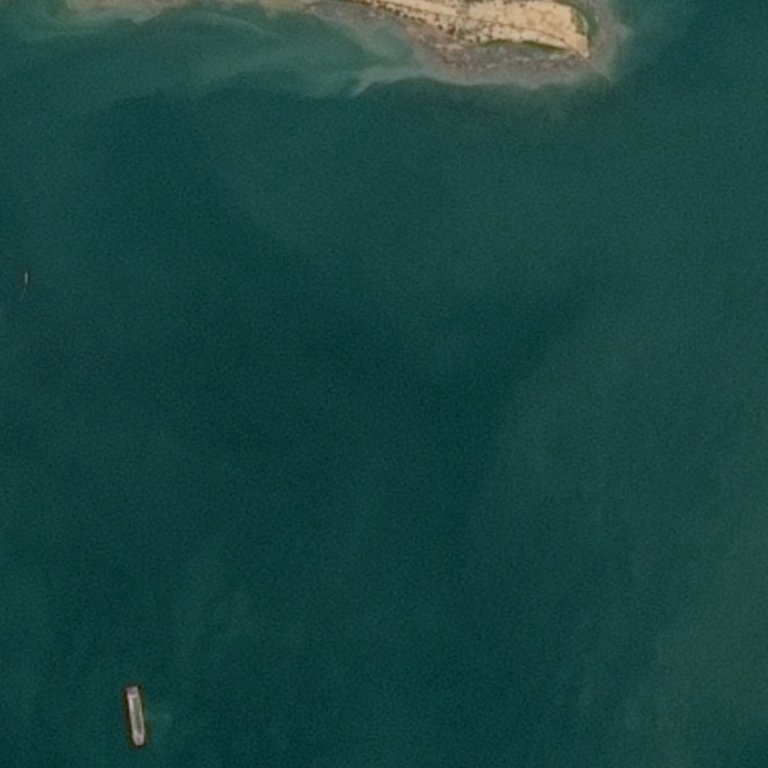
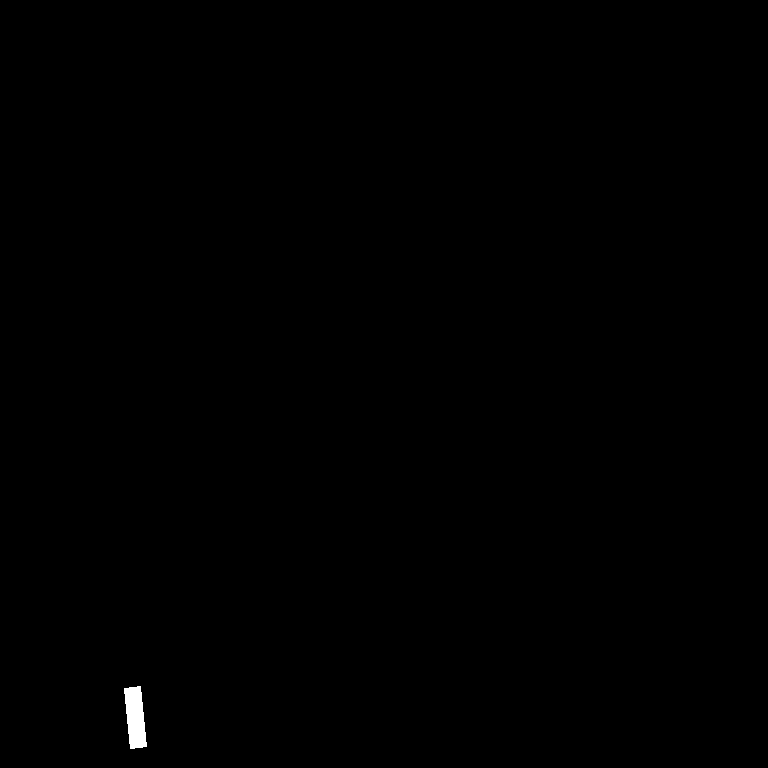

## Airbus Ship Detection Challenge

### Overview
This documentation provides information about the Airbus Ship Detection Challenge kaggle competition, including the data used, the methods and ideas employed, and the metrics achieved. It also includes usage instructions and author information.

    





### Data
The dataset used for training and scoring is loaded with tensorflow and consists images with ships.

[Link to the dataset on Kaggle](https://www.kaggle.com/competitions/airbus-ship-detection)
## Model Architecture
The Airbus Ship Detection neural network model is built using the Unet architecture. The architecture of the model consists two parts -- encoder and decoder.
## DICE coefficient 
After training, the model achieved a dice coefficient of 0.75 on the validation set on 20 epochs.
## Usage
### Requirements

- Python 3.10

### Getting Started
Clone repository
```bash
git clone https://github.com/SoulHb/Airbus.git
```
Move to project folder
```bash
cd Airbus
```
Create conda env or other virtual environments
```bash
conda create --name=airbus python=3.10
```
Activate virtual environment
```bash
conda activate --name=airbus 
```
Install pip 
```bash
conda install pip 
```
Install dependencies
```bash
pip install -r requirements.txt
```
### Training
The model is trained on the provided dataset using the following configuration:
- Optimizer: Adam
- Learning rate: 0.001
- Loss function: Binary_Crossentropy
- Batch size: 16
- Number of epochs: 20

Move to src folder
```bash
cd src
```
Run train.py
```bash
python train.py \
    --image_height 256 \
    --image_width 256 \
    --images_path /path/to/train_v2 \
    --masks_path /path/to/train_ship_segmentations_v2.csv \
    --epochs 10 \
    --lr 0.001 \
    --batch_size 32 \
    --saved_model_path /path/to/saved_model
```

## Inference
To use the trained model for Airbus Ship Detection, follow the instructions below:

Move to src folder
```bash
cd src
```
Run Flask api
```bash
python inference.py --saved_model_path /path/to/saved_model --saved_submission_path /path/to/submission.csv
```

## Author
This TikTok segmentation project was developed by Namchuk Maksym. If you have any questions, please contact me: namchuk.maksym@gmail.com
